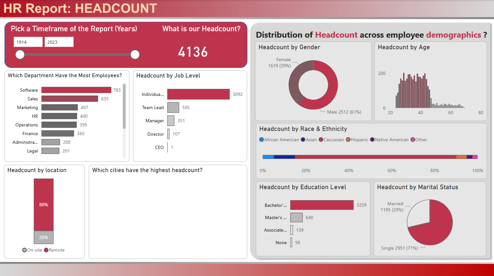

# HR Data Analysis (Power BI)

## Overview
This project presents an HR analytics dashboard built using Microsoft Power BI.  
The dashboard helps analyze employee data to identify trends related to attrition, workforce demographics, and employee performance.

## Project File
- `HR Data Analysis.pbix` – Main Power BI dashboard file

## 🖼 Dashboard Preview

## 📂 Project Structure
HR-Data-Analysis_PowerBI/

│

├── datasets/

├── HR Data Analysis.pbix

├── README.md

└── dashboard-screenshot.png

## Key Insights
The dashboard analyzes:

- Employee Attrition
- Department distribution
- Age and gender analysis
- Job roles and salary insights
- Employee performance trends

## Tools Used
- Microsoft Power BI
- Data Visualization
- HR Analytics

## Dashboard Features
- Interactive charts
- KPI metrics
- Department filtering
- Employee demographic analysis

## How to Use
1. Download the `.pbix` file
2. Open using **Microsoft Power BI Desktop**
3. Explore interactive dashboards and filters

## Project Purpose
This project demonstrates how HR data can be visualized to support data-driven decision making in organizations.

## Author
Ye Htet Hein
